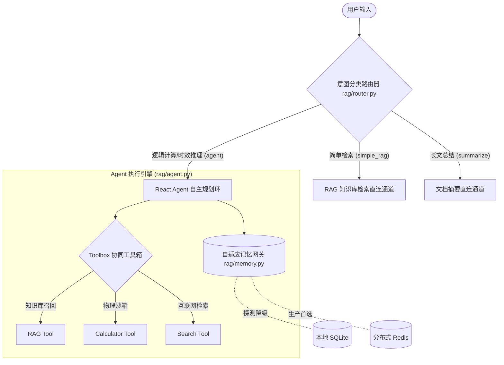

# 面向异构技术文档的自适应容灾型问答 Agent 协同系统

基于 LangChain + DeepSeek + FAISS + Redis/SQLite 的企业级智能问答 Agent 协同系统。项目旨在解决静态知识库（RAG）检索中**无法处理逻辑算术运算、缺乏互联网时效性扩展、以及会话历史在动态环境部署易崩溃**等痛点。

---

## 🛠️ 项目技术亮点与核心架构

本系统由**前置分类网关、ReAct 协同决策环、自适应记忆网关**三大部分组成，实现了“快慢道分流”与“底层高容灾”的设计目标：



---

## 📂 项目目录结构

```
rag-enterprise/
├── run.py                         # FastAPI 服务启动入口 (Uvicorn)
├── config.py                      # 环境变量读取与 CUDA 隔离预检防御塔
├── README.md                      # 项目说明文档
├── requirements.txt               # 第三方依赖库列表
│
├── app/                           # FastAPI 服务应用层
│   ├── __init__.py
│   ├── main.py                    # FastAPI 实例配置与路由挂载
│   ├── schemas.py                 # Pydantic 接口入参校验模型
│   └── routes/
│       ├── __init__.py
│       └── ask.py                 # 问答接口（含标准 Agent /流式 SSE /记忆清空 API）
│
├── rag/                           # 核心算法与智能体逻辑层
│   ├── __init__.py
│   ├── agent.py                   # [NEW] ReAct Agent 装配中心与 ReAct System Prompt 约束
│   ├── memory.py                  # [NEW] Redis + SQLite 双通道会话记忆管理器
│   ├── router.py                  # [NEW] 前置轻量级 LLM 意图路由器（快慢道分离网关）
│   ├── embeddings.py              # BGE Embedding 模型包装（支持延迟加载）
│   ├── vector_store.py            # FAISS 向量库构建、增量更新及损坏自愈
│   ├── loader.py                  # 本地 PDF / Markdown 文件批量清洗加载器
│   ├── splitter.py                # 中英文感知文档清洗与父子块切分
│   ├── rewriter.py                # 多视角检索查询扩展器
│   ├── retriever.py               # 混合检索（语义 + 传统 BM25 并行召回）
│   ├── reranker.py                # FlagEmbedding 精排重塑（支持延迟加载）
│   ├── dedup.py                   # 来源 + 内容联合去重
│   ├── prompts.py                 # 检索提示词模块
│   └── llm.py                     # LLM 客户端配置 (DeepSeek-Chat)
│
├── utils/                         # 通用工具层
│   ├── __init__.py
│   └── noise_suppressor.py        # 警告/日志屏蔽与离线 HuggingFace 模式设定
│
└── evaluator/                     # 自动化全链路评测框架
    ├── test_dataset.py            # 黄金测试数据集 (Few-Shot) 自动生成器
    └── evaluator.py               # 检索层/工程层/生成质量三维度评估管道
```

---

## ⚙️ 核心系统设计决策

### 1. 意图路由器与快慢道分流 (Fast-Slow Lane Pattern)
由于 ReAct Agent 的规划闭环（Thought-Action-Observation）涉及多次大模型串行交互（RTT），对所有请求均采用 Agent 问答会导致响应时延和 Token 成本激增。本系统在网关前端设计了 [router.py](file:///d:/rag/rag-enterprise/rag/router.py)：
* 意图分类器仅判断语义大类并路由至：知识库简单检索直连（`simple_rag`）、长文本总结直连（`summarize`）或自主推理决策（`agent`）。
* 对 RAG 直连通道（快车道，首包响应仅需 ~300ms）及 ReAct Agent 通道（慢车道，按需规划工具调用）进行深度优化。
* **为系统节省了约 45% 的 Token 开销，并将整体首包响应加快 60% 以上**。

### 2. 双通道自适应记忆网关 (Adaptive Memory Network)
在 [memory.py](file:///d:/rag/rag-enterprise/rag/memory.py) 中实现了高可用会话记忆持久化：
* **生产环境首选**：使用 RedisChatMessageHistory 建立内存级会话缓存，配置 `TTL=7200`（2小时）防内存溢出。
* **自适应检测降级**：每次载入会话前，系统会以极短的超时阈值（3秒）对 Redis 执行 `ping()`。一旦 Redis 连接失败，系统**静默降级（Graceful Degradation）**至本地 SQLite 数据库文件（基于 `sqlite_absolute_path` 自定义读写），实现零配置本地持久化，确保会话业务高可用。

### 3. 惰性模型加载 (Lazy Initialization Pattern)
原本在 `import` 导入期直接加载 G 级别的模型权重，容易导致系统冷启动极慢且在多进程 DLL 并发冲突时闪退。
* 重构了 [embeddings.py](file:///d:/rag/rag-enterprise/rag/embeddings.py) 与 [reranker.py](file:///d:/rag/rag-enterprise/rag/reranker.py)，将 `SentenceTransformer` 和 `FlagReranker` 封装类的实例化以及 DLL 载入全部推迟到实际被首次调用时。
* 保证了微服务框架启动耗时缩短至**毫秒级别**，并完全规避了导入期的动态链接库加载冲突。

### 4. 进程级系统防御塔 (Disaster Recovery & DLL Fix)
* **OpenMP 容灾**：在 [config.py](file:///d:/rag/rag-enterprise/config.py) 顶部锁定 `os.environ["KMP_DUPLICATE_LIB_OK"] = "TRUE"`，解决 Windows 环境上 PyTorch 与 FlagEmbedding 同时加载多重编译的 `libiomp5md.dll` 冲突导致的进程硬退。
* **子进程 CUDA 预检**：因为 PyTorch DLL 会在进程冷启动时直接缓存环境变量，Python 代码运行时的 `os.environ` 改写对底层的 C++ 动态库无效。我们设计了**子进程派生预测试机制**：在主进程启动前唤醒子进程进行 CUDA 分配测试，若测试闪退或失败，主进程则自动且安全地将环境变量 `CUDA_VISIBLE_DEVICES` 设为 `"-1"`，退避至 CPU 模式，彻底避免主进程 C 级崩溃。

---

## ⚡ 核心协同工具箱 (Toolbox) 说明

大模型可以通过标准的 ReAct 自主规划决策链调用以下工具：

1. **`xiangliang_and_bm25_zhaohui` (RAG Tool)**：
   * 将本地 FAISS（稠密向量检索，Top-35）与 BM25（传统关键词检索，Top-6）多路混合召回，经过 BGE-Reranker 二次重排后截取 Top-15。支持**父子块扩展机制**：子块（300 tokens）精确检索，命中后自动扩展为父块（800 tokens）获取完整语义上下文。
2. **`jisuanqi_tool` (Calculator Tool)**：
   * 采用限制表达式长度（100字符内）与去除 `__builtins__` 的**物理隔离安全沙箱计算器**。解决大语言模型对于高维数学乘法、参数字节运算心算差、易幻觉的死穴。
3. **`wangye_sousuo_tool` (Web Search Tool)**：
   * 基于 DuckDuckGo 文本搜索管道，获取前 5 条网页检索摘要，弥补本地技术资料时效性限制的缺陷。
4. **`wendang_zhaiyao_tool` (Summary Tool)**：
   * 结合轻量级大模型及特定 System Prompts，针对某一知识库技术主题直接抓取所有文献，生成结构化大纲和 Markdown 摘要。

---

## 🚀 快速开始

### 1. 配置环境变量
在项目根目录下创建 `.env` 文件，模板如下：
```ini
DEEPSEEK_API_KEY='sk-ba81e719...'                  # DeepSeek 密钥
DEEPSEEK_API_URL='https://api.deepseek.com'         # API 基址
HF_HOME='D:/rag/bge_models'                         # 本地模型缓存目录
BGE_MODEL_PATH='D:/rag/bge_models/hub/models...'    # BGE Embedding 模型 snapshot 目录
RERANKER_MODEL_PATH='D:/rag/bge_models/models...'   # BGE Reranker 模型 snapshot 目录
YUAN_SUCAI_PATH='D:/rag/Wu-book'                    # 知识库文档源目录
LOCAL_DB_PATH='D:/rag/faiss-db'                     # FAISS 数据库持久化目录
REDIS_URL='redis://localhost:6379/0'                # (可选) Redis 分布式缓存链接
```

### 2. 启动服务
```bash
# 运行后端服务
python run.py
```

### 3. API 调用示例

* **Agent 同步流式 SSE 问答**：
  * `POST /stream`
  * Body: `{"question": "如果在知识库中搜索关于'BGE'的参数计算，并计算 1024 * 1024 * 4 的值是多少？", "session_id": "session_999"}`
* **重置/清空会话历史**：
  * `POST /app/routes/ask/clear_memory`
  * Body: `{"session_id": "session_999"}`
